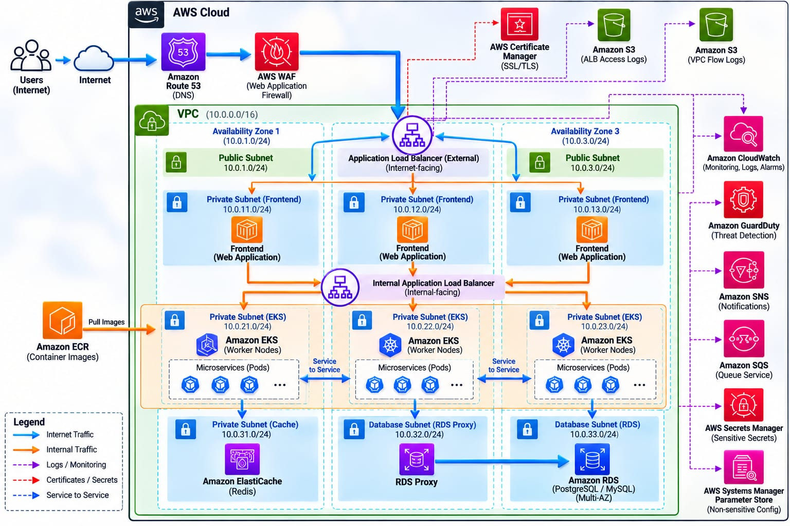

# pip-project-ecommerce — Architecture Document

**Project:** pip-project-ecommerce  
**Type:** Multi-tenant SaaS E-Commerce Platform  
**Architecture Pattern:** 3-Tier (Presentation → Application → Data)  
**Cloud Provider:** Amazon Web Services (AWS)  
**Infrastructure as Code:** Terraform  
**Container Orchestration:** Kubernetes (Amazon EKS)

---



## Table of Contents

1. [What We Are Building](#1-what-we-are-building)
2. [High-Level Architecture](#2-high-level-architecture)
3. [Repository Structure](#3-repository-structure)
4. [Network Design (VPC)](#4-network-design-vpc)
5. [Application Services](#5-application-services)
6. [Traffic Flow — Step by Step](#6-traffic-flow--step-by-step)
7. [Data Layer](#7-data-layer)
8. [Security Design](#8-security-design)
9. [CI/CD Pipeline](#9-cicd-pipeline)
10. [Disaster Recovery](#10-disaster-recovery)
11. [AWS Services Used](#11-aws-services-used)
12. [draw.io Diagram Prompt](#12-drawio-diagram-prompt)

---
<video controls src="WhatsApp Video 2026-09-29 at 01.46.43.mp4" title="Title"></video>
## 1. What We Are Building

We are building an **e-commerce web application** that allows users to browse products, add items to a cart, make payments, and receive order notifications.

Think of it like a simplified version of Amazon or Flipkart — but built on modern cloud-native architecture.

### Why 3-Tier Architecture?

```
┌────────────────────────────────────────────────────────────┐
│  TIER 1 — PRESENTATION  (what the user sees)               │
│  Next.js frontend running in browser                        │
├────────────────────────────────────────────────────────────┤
│  TIER 2 — APPLICATION   (business logic)                   │
│  6 microservices: user, product, cart, order,              │
│  payment, notification — each handles one job             │
├────────────────────────────────────────────────────────────┤
│  TIER 3 — DATA          (storage)                          │
│  Aurora PostgreSQL (permanent data) +                      │
│  ElastiCache Redis (fast temporary data)                   │
└────────────────────────────────────────────────────────────┘
```

**Why separate tiers?**
- If the database becomes slow, only Tier 3 is affected — frontend still loads
- Each tier can be scaled independently
- Security: database is never directly reachable from the internet

---

## 2. High-Level Architecture

```
Internet
    │
    ▼
┌─────────────────────────────────────────────┐
│  Route53 (DNS)                              │
│  ecommerce-pip.com → ALB                   │
└──────────────────┬──────────────────────────┘
                   │
                   ▼
┌─────────────────────────────────────────────┐
│  AWS WAF                                    │
│  Blocks: SQL injection, XSS, bad bots       │
│  Rate limit: 100 req/min per IP             │
└──────────────────┬──────────────────────────┘
                   │
                   ▼
┌─────────────────────────────────────────────┐
│  External ALB (internet-facing)             │
│  HTTPS on port 443, HTTP redirects to 443   │
│  Public Subnets: 10.1.1.0/24 – 10.1.3.0/24 │
└──────────────────┬──────────────────────────┘
                   │
                   ▼
┌─────────────────────────────────────────────┐
│  EKS — Frontend Pods (3 replicas)           │
│  Next.js app, port 3000                     │
│  Private Subnets: 10.1.11.0/24 – 10.1.13.0 │
└──────────────────┬──────────────────────────┘
                   │  /api/* calls
                   ▼
┌─────────────────────────────────────────────┐
│  Internal ALB (private, VPC-only)           │
│  HTTP port 80, path-based routing           │
└──┬──────┬──────┬──────┬──────┬─────────────┘
   │      │      │      │      │
   ▼      ▼      ▼      ▼      ▼
 user  product  cart  order payment  notification
 4001   4002   4003   4004   4005       4006
   │      │      │      │      │          │
   └──────┴──────┴──────┴──────┴──────────┘
                   │
                   ▼
┌─────────────────────────────────────────────┐
│  RDS Proxy (connection pooling)             │
│  Database Subnets: 10.1.21.0/24–10.1.23.0  │
└──────────────────┬──────────────────────────┘
                   │
                   ▼
┌─────────────────────────────────────────────┐
│  Aurora PostgreSQL (Multi-AZ)               │
│  1 Writer + 2 Readers across 3 AZs          │
│  Global Database replica → us-west-2 (DR)  │
└─────────────────────────────────────────────┘

┌─────────────────────────────────────────────┐
│  ElastiCache Redis                          │
│  Sessions, cart cache, rate limits          │
│  Private Subnets, TLS + AUTH enabled        │
└─────────────────────────────────────────────┘
```

---

## 3. Repository Structure

```
pip-project-ecommerce/
│
├── 01-Infrastructure/          ← Terraform code
│   ├── environments/
│   │   ├── dev/                ← Dev environment (ap-south-1)
│   │   │   ├── main.tf         ← Module wiring
│   │   │   ├── variables.tf    ← Variable declarations
│   │   │   ├── dev.tfvars      ← Non-sensitive values
│   │   │   ├── backend.tf      ← S3 state backend
│   │   │   └── providers.tf    ← AWS, Helm, K8s providers
│   │   └── prod/               ← Prod environment (us-east-1)
│   └── modules/
│       ├── networking/         ← VPC, subnets, route tables, NACLs, SGs
│       ├── eks/                ← EKS cluster + node groups
│       ├── eks-addons/         ← ALB controller, autoscaler, CSI, Fluent Bit
│       ├── aurora/             ← Aurora PostgreSQL + RDS Proxy + Global DB
│       ├── elasticache/        ← Redis cluster
│       ├── security/           ← KMS, Secrets Manager, GuardDuty, VPC Flow Logs
│       ├── waf/                ← WAF WebACL + S3 logs bucket
│       ├── iam/                ← EKS cluster/node roles
│       ├── iam-irsa/           ← IRSA roles for pods (OIDC-based)
│       ├── messaging/          ← SNS + SQS
│       ├── compute/            ← Bastion + Jenkins EC2
│       └── route53-acm/        ← DNS + SSL certificate
│
├── 02-Application-Code/        ← Microservices source code
│   ├── frontend/               ← Next.js (TypeScript)
│   └── services/
│       ├── user-service/       ← Port 4001 — auth, registration
│       ├── product-service/    ← Port 4002 — catalog, search
│       ├── cart-service/       ← Port 4003 — shopping cart
│       ├── order-service/      ← Port 4004 — order management
│       ├── payment-service/    ← Port 4005 — payment processing
│       └── notification-service/ ← Port 4006 — SMS + email
│
├── 03-Kubernetes/              ← K8s manifests
│   ├── frontend/               ← Deployment, Service, Ingress, HPA
│   ├── services/               ← Per-service Deployment + Service YAMLs
│   ├── secrets/                ← SecretProviderClass, ServiceAccount, ConfigMap
│   └── argocd/                 ← ArgoCD Application + AppProject
│
├── 04-Jenkins/                 ← CI/CD pipelines
│   ├── infra-pipeline/         ← Terraform plan/apply/destroy
│   └── ci-pipeline/            ← Build, test, scan, push, deploy
│
└── 05-Documents/               ← This folder — all documentation
    ├── architecture.md         ← This file
    ├── slo-sla.md              ← Service level objectives
    ├── cost-model.md           ← Monthly cost projections
    └── runbooks/               ← Operational procedures
```

---

## 4. Network Design (VPC)

### Why 3-Tier Subnets?

Each tier of the application lives in its own subnet. This is like having separate floors in a building — each floor has different access rules.

```
VPC: 10.1.0.0/16 (prod) / 10.0.0.0/16 (dev)
│
├── Public Subnets (3 AZs)       10.x.1-3.0/24
│   ├── What lives here: External ALB, Bastion EC2, NAT Gateway
│   ├── Internet access: DIRECT via Internet Gateway (IGW)
│   └── Rule: Only load balancers and jump hosts — no application pods
│
├── Private Subnets (3 AZs)      10.x.11-13.0/24
│   ├── What lives here: EKS worker nodes, all application pods
│   ├── Internet access: OUTBOUND only via NAT Gateway (to pull images, call AWS APIs)
│   └── Rule: Application pods live here — no direct internet access
│
└── Database Subnets (3 AZs)     10.x.21-23.0/24
    ├── What lives here: Aurora RDS, ElastiCache Redis, RDS Proxy
    ├── Internet access: NONE (database never initiates outbound connections)
    └── Rule: Only EKS nodes can connect — port 5432 (Postgres) + 6379 (Redis)
```

### Availability Zones

| Resource | AZ-1 | AZ-2 | AZ-3 |
|---|---|---|---|
| Public Subnet | ✅ | ✅ | ✅ |
| Private Subnet | ✅ | ✅ | ✅ |
| Database Subnet | ✅ | ✅ | ✅ |
| EKS Worker Nodes | ✅ | ✅ | ✅ |
| Aurora Instance | Writer | Reader 1 | Reader 2 |
| ElastiCache Redis | Primary | Replica | — |

> **Why 3 AZs?** If one data centre (AZ) has a power failure or network issue, the application continues running on the other two. This is called **high availability**.

---

## 5. Application Services

### Microservices Overview

Each service is an independent Node.js + TypeScript application. They each have their own database schema and communicate via HTTP.

| Service | Port | Database | Purpose |
|---|---|---|---|
| user-service | 4001 | user_db | Register, login, JWT tokens, user profiles |
| product-service | 4002 | product_db | Product catalog, search, inventory |
| cart-service | 4003 | cart_db | Add/remove cart items (also uses Redis cache) |
| order-service | 4004 | order_db | Place orders, verify payment, track delivery |
| payment-service | 4005 | payment_db | Process payments, idempotency (also uses Redis) |
| notification-service | 4006 | none | Send SMS (SNS) and email (SES) notifications |
| frontend | 3000 | none | Next.js UI — calls all services via internal ALB |

### How Services Talk to Each Other

```
User's Browser
      │  HTTPS
      ▼
External ALB  ──── WAF ────► blocks malicious requests
      │  HTTP
      ▼
frontend (Next.js)
      │  /api/users/*   ──────────────► user-service
      │  /api/products/* ─────────────► product-service
      │  /api/cart/*    ──────────────► cart-service
      │  /api/orders/*  ──────────────► order-service
      │  /api/payments/* ─────────────► payment-service
                                             │
                                    calls user-service
                                    for user contact info
                                             │
                                    publishes to SNS
                                             │
                                             ▼
                                    notification-service
                                    (sends SMS + email)
```

### Redis Usage (ElastiCache)

| Service | What Redis Stores | Why |
|---|---|---|
| cart-service | Active cart items | Faster than DB for every-page-view reads |
| user-service | JWT blacklist (logged-out tokens) | Stateless JWT can't be revoked without a store |
| payment-service | Idempotency keys | Prevents double-charging on payment retry |
| All services | Rate limit counters | Atomic counters work across all pod replicas |

---

## 6. Traffic Flow — Step by Step

This explains what happens when a user visits the website and buys a product:

```
Step 1: User types ecommerce-pip.com in browser
         └─► Route53 resolves domain to External ALB IP

Step 2: Request hits AWS WAF
         └─► WAF checks: SQL injection? XSS? Rate limit exceeded?
         └─► If malicious → BLOCK (403)
         └─► If clean → ALLOW → forward to ALB

Step 3: ALB receives HTTPS request on port 443
         └─► ACM certificate handles TLS decryption
         └─► Forwards HTTP to frontend pod on port 3000

Step 4: Frontend (Next.js) renders the product page
         └─► Calls internal ALB: GET /api/products
         └─► Internal ALB routes to product-service:4002
         └─► product-service queries Aurora PostgreSQL
         └─► Returns product list to frontend

Step 5: User adds item to cart
         └─► Frontend: POST /api/cart/items
         └─► cart-service checks Redis first (cache hit?)
         └─► Writes to Aurora + updates Redis cache

Step 6: User clicks "Pay"
         └─► Frontend: POST /api/payments with JWT token
         └─► payment-service verifies JWT
         └─► Checks Redis idempotency key (prevent double-charge)
         └─► Saves payment record in payment_db
         └─► Publishes PAYMENT_SUCCESS event to SNS

Step 7: Order is created
         └─► order-service receives request with transaction ID
         └─► Calls payment-service to verify payment is SUCCESS
         └─► Calls user-service /internal/users/:id for contact info
         └─► Creates order record in order_db
         └─► Publishes ORDER_CONFIRMED event to SNS

Step 8: User receives notification
         └─► notification-service receives SNS event
         └─► Sends SMS via SNS (if phone provided)
         └─► Sends email via SES (if email provided)
```

---

## 7. Data Layer

### Aurora PostgreSQL

| Property | Dev | Prod |
|---|---|---|
| Engine | Aurora PostgreSQL 17.9 | Aurora PostgreSQL 17.9 |
| Instance class | db.r5.large | db.r6g.large |
| Writer instances | 1 | 1 |
| Reader instances | 1 | 2 |
| Multi-AZ | Yes | Yes |
| Global Database (DR) | No | Yes (us-west-2) |
| Encryption | KMS | KMS |
| Backup retention | 35 days | 35 days |
| RDS Proxy | Yes | Yes |
| Deletion protection | Off | ON |

#### Why RDS Proxy?

```
Without RDS Proxy:          With RDS Proxy:
Each pod → DB directly      All pods → Proxy → DB
10 pods = 10 connections    10 pods, but proxy uses 2 connections
100 pods = 100 connections  Proxy handles pooling — DB stays healthy
Aurora max: ~300 conn       Aurora max: ~300 conn (but used efficiently)
```

### ElastiCache Redis

| Property | Dev | Prod |
|---|---|---|
| Node type | cache.t3.micro | cache.r6g.large |
| Replicas | 0 | 1 |
| Multi-AZ failover | No | Yes |
| TLS in-transit | Yes | Yes |
| KMS at-rest | Yes | Yes |
| AUTH token | Secrets Manager | Secrets Manager |

---

## 8. Security Design

### Defence in Depth — Layers of Protection

```
Layer 1: Network Edge
  AWS WAF → blocks OWASP Top 10, rate limits IPs
  Route53 → DNS-level protection

Layer 2: Network
  VPC → private network, isolated from internet
  NACLs → subnet-level firewall (stateless)
  Security Groups → instance-level firewall (stateful)
  VPC Flow Logs → records all network traffic

Layer 3: Compute
  EKS nodes in private subnets → no public IP
  Bastion via SSM → no SSH keys, all access logged
  IMDSv2 required → prevents SSRF attacks on EC2

Layer 4: Application
  JWT authentication on all /api/* endpoints
  Internal service key on /internal/* endpoints
  HTTPS everywhere (ALB terminates TLS with ACM cert)

Layer 5: Data
  KMS encryption for all data at rest:
    ├─ Aurora PostgreSQL (KMS)
    ├─ ElastiCache Redis (KMS)
    ├─ S3 buckets (KMS)
    ├─ Secrets Manager secrets (KMS)
    └─ SSM SecureString parameters (KMS)
  RDS Proxy requires TLS for DB connections
  Secrets Manager for DB passwords (auto-rotatable)
  SSM SecureString for JWT secret + internal key

Layer 6: Detection
  GuardDuty → AI-based threat detection on EC2, EKS, S3
  CloudWatch Alarms → automated alerting
  CloudTrail → all API calls logged (default, always on)
```

### Secrets Management

| Secret | Where Stored | How Pods Access |
|---|---|---|
| DB password | AWS Secrets Manager | Secrets Store CSI driver → file mount |
| Redis auth token | AWS Secrets Manager | Secrets Store CSI driver → file mount |
| JWT secret | SSM SecureString | Secrets Store CSI driver → K8s Secret |
| Internal service key | SSM SecureString | Secrets Store CSI driver → K8s Secret |
| Redis host (non-sensitive) | SSM String | ecommerce-config ConfigMap |
| SNS ARN (non-sensitive) | SSM String | ecommerce-config ConfigMap |

> **Key principle:** No secret ever lives in a YAML file, environment variable baked into a Docker image, or `.env` file committed to git.

---

## 9. CI/CD Pipeline

### Two Pipelines, Two Jobs

```
┌─────────────────────────────────────────────────────┐
│  PIPELINE 1: Infrastructure (Jenkins)               │
│  Runs: manually, when infra changes are needed      │
│                                                     │
│  terraform plan → Manual Approval → terraform apply │
│  → patch K8s YAML placeholders with real ARNs       │
│  → bootstrap ArgoCD on EKS                          │
│  → deploy K8s manifests                             │
│  → EKS smoke tests (dev only)                       │
│  → Route53 A-records                                │
└─────────────────────────────────────────────────────┘

┌─────────────────────────────────────────────────────┐
│  PIPELINE 2: CI/CD (Jenkins → ArgoCD)               │
│  Runs: on every code push to feature branch         │
│                                                     │
│  SonarQube SAST → npm build + test                  │
│  → docker build (ONCE)                              │
│  → docker-compose up → smoke tests                  │
│  → trivy scan → push to ECR                         │
│  → yq patch deployment YAMLs with new image tag     │
│  → push to release/vX.Y.Z branch                   │
│  → gh pr create release → main                      │
│  ↓ human reviews + approves PR                      │
│  → merge to main                                    │
│  → ArgoCD detects change → deploys to EKS           │
└─────────────────────────────────────────────────────┘
```

### Why ArgoCD (GitOps)?

ArgoCD watches the `main` branch of this repository. When a PR is merged, ArgoCD:
1. Detects the change (polls every 3 minutes)
2. Compares what's in git vs what's running in the cluster
3. Applies the difference (new image tag = rolling update)
4. Sends a Slack notification when done

> **The golden rule of GitOps:** Git is the single source of truth. If you want to change what's running in production, you change a file in git and let ArgoCD apply it. You never run `kubectl apply` directly in production.

---

## 10. Disaster Recovery

### Strategy: Active-Standby (Multi-Region)

| Component | Primary | DR (Standby) |
|---|---|---|
| Region | us-east-1 (N. Virginia) | us-west-2 (Oregon) |
| Aurora | Writer + 2 Readers | Global DB replica (read-only) |
| EKS | Active cluster | Not running (save cost) |
| Route53 | A-record → primary ALB | Health check failover → DR ALB |

### Failover Process

```
Normal operation:
  User → Route53 → us-east-1 ALB → EKS pods → Aurora Writer

Failure detected (health check fails):
  Route53 detects primary ALB unhealthy (health check every 30s)
      │
      ▼
  Route53 switches DNS to DR ALB (< 2 minutes TTL)
      │
      ▼
  Ops team promotes Aurora Global DB secondary to writer
  (RTO: < 1 minute for Aurora promotion)
      │
      ▼
  EKS cluster in us-west-2 spun up with same ArgoCD config
  (RPO: < 1 hour — last Aurora replication lag)
```

| Metric | Target | How Achieved |
|---|---|---|
| RTO (Recovery Time Objective) | < 2 minutes | Route53 health check failover |
| RPO (Recovery Point Objective) | < 1 hour | Aurora Global DB replication lag < 1s |
| Availability | 99.95% | Multi-AZ + Multi-Region |

---

## 11. AWS Services Used

| Category | Service | Purpose |
|---|---|---|
| DNS | Route53 | Domain routing + health check failover |
| Security | WAF v2 | OWASP protection, rate limiting |
| Security | ACM | Free SSL/TLS certificates |
| Security | GuardDuty | AI threat detection |
| Security | KMS | Encryption key management |
| Security | Secrets Manager | DB + Redis credentials |
| Security | SSM Parameter Store | App config + app secrets |
| Networking | VPC | Private network |
| Networking | ALB | Layer 7 load balancer |
| Compute | EKS | Kubernetes cluster |
| Compute | EC2 (Bastion) | Jump host (SSM only) |
| Compute | EC2 (Jenkins) | CI/CD server |
| Database | Aurora PostgreSQL | Relational database |
| Database | ElastiCache Redis | Cache + session store |
| Storage | S3 | WAF logs, ALB logs, CI artifacts |
| Messaging | SNS | Event notifications (email, SMS, SQS) |
| Messaging | SQS | Decoupled queue for pipeline failures |
| Monitoring | CloudWatch | Metrics, alarms, logs |
| CI/CD | ECR | Docker image registry |
| CI/CD | ArgoCD | GitOps deployment |

---

## 12. draw.io Diagram Prompt

Copy the prompt below and paste it into **draw.io** (app.diagrams.net) using:
`Extras → Edit Diagram` → paste XML.

This uses official AWS architecture icons.

```xml
<mxGraphModel>
  <root>
    <mxCell id="0"/><mxCell id="1" parent="0"/>

    <!-- Internet -->
    <mxCell id="2" value="Internet" style="shape=mxgraph.aws4.resourceIcon;resIcon=mxgraph.aws4.internet_gateway;labelBackgroundColor=#ffffff;" vertex="1" parent="1"><mxGeometry x="360" y="20" width="60" height="60" as="geometry"/></mxCell>

    <!-- Route53 -->
    <mxCell id="3" value="Route53&#xa;ecommerce-pip.com" style="shape=mxgraph.aws4.resourceIcon;resIcon=mxgraph.aws4.route_53;labelBackgroundColor=#ffffff;" vertex="1" parent="1"><mxGeometry x="360" y="120" width="60" height="60" as="geometry"/></mxCell>

    <!-- WAF -->
    <mxCell id="4" value="AWS WAF&#xa;OWASP + Rate Limit" style="shape=mxgraph.aws4.resourceIcon;resIcon=mxgraph.aws4.waf;labelBackgroundColor=#ffffff;" vertex="1" parent="1"><mxGeometry x="360" y="220" width="60" height="60" as="geometry"/></mxCell>

    <!-- External ALB -->
    <mxCell id="5" value="External ALB&#xa;internet-facing&#xa;HTTPS 443" style="shape=mxgraph.aws4.resourceIcon;resIcon=mxgraph.aws4.application_load_balancer;labelBackgroundColor=#ffffff;" vertex="1" parent="1"><mxGeometry x="360" y="320" width="60" height="60" as="geometry"/></mxCell>

    <!-- Public Subnet box -->
    <mxCell id="6" value="Public Subnets (3 AZs)" style="swimlane;startSize=20;fillColor=#dae8fc;strokeColor=#6c8ebf;" vertex="1" parent="1"><mxGeometry x="160" y="300" width="460" height="110" as="geometry"/></mxCell>

    <!-- Frontend pods -->
    <mxCell id="7" value="Frontend Pods&#xa;Next.js :3000&#xa;(3 replicas)" style="shape=mxgraph.aws4.resourceIcon;resIcon=mxgraph.aws4.eks;labelBackgroundColor=#ffffff;" vertex="1" parent="1"><mxGeometry x="360" y="450" width="60" height="60" as="geometry"/></mxCell>

    <!-- Internal ALB -->
    <mxCell id="8" value="Internal ALB&#xa;private&#xa;HTTP 80" style="shape=mxgraph.aws4.resourceIcon;resIcon=mxgraph.aws4.application_load_balancer;labelBackgroundColor=#ffffff;" vertex="1" parent="1"><mxGeometry x="360" y="550" width="60" height="60" as="geometry"/></mxCell>

    <!-- Private Subnet box -->
    <mxCell id="9" value="Private Subnets (3 AZs)" style="swimlane;startSize=20;fillColor=#d5e8d4;strokeColor=#82b366;" vertex="1" parent="1"><mxGeometry x="80" y="430" width="620" height="250" as="geometry"/></mxCell>

    <!-- Services -->
    <mxCell id="10" value="user-service&#xa;:4001" style="shape=mxgraph.aws4.resourceIcon;resIcon=mxgraph.aws4.eks;labelBackgroundColor=#ffffff;" vertex="1" parent="1"><mxGeometry x="100" y="650" width="50" height="50" as="geometry"/></mxCell>
    <mxCell id="11" value="product-service&#xa;:4002" style="shape=mxgraph.aws4.resourceIcon;resIcon=mxgraph.aws4.eks;labelBackgroundColor=#ffffff;" vertex="1" parent="1"><mxGeometry x="190" y="650" width="50" height="50" as="geometry"/></mxCell>
    <mxCell id="12" value="cart-service&#xa;:4003" style="shape=mxgraph.aws4.resourceIcon;resIcon=mxgraph.aws4.eks;labelBackgroundColor=#ffffff;" vertex="1" parent="1"><mxGeometry x="280" y="650" width="50" height="50" as="geometry"/></mxCell>
    <mxCell id="13" value="order-service&#xa;:4004" style="shape=mxgraph.aws4.resourceIcon;resIcon=mxgraph.aws4.eks;labelBackgroundColor=#ffffff;" vertex="1" parent="1"><mxGeometry x="370" y="650" width="50" height="50" as="geometry"/></mxCell>
    <mxCell id="14" value="payment-service&#xa;:4005" style="shape=mxgraph.aws4.resourceIcon;resIcon=mxgraph.aws4.eks;labelBackgroundColor=#ffffff;" vertex="1" parent="1"><mxGeometry x="460" y="650" width="50" height="50" as="geometry"/></mxCell>
    <mxCell id="15" value="notification&#xa;:4006" style="shape=mxgraph.aws4.resourceIcon;resIcon=mxgraph.aws4.eks;labelBackgroundColor=#ffffff;" vertex="1" parent="1"><mxGeometry x="550" y="650" width="50" height="50" as="geometry"/></mxCell>

    <!-- Database Subnet box -->
    <mxCell id="16" value="Database Subnets (3 AZs)" style="swimlane;startSize=20;fillColor=#fff2cc;strokeColor=#d6b656;" vertex="1" parent="1"><mxGeometry x="80" y="730" width="620" height="130" as="geometry"/></mxCell>

    <!-- RDS Proxy -->
    <mxCell id="17" value="RDS Proxy&#xa;Connection Pooling" style="shape=mxgraph.aws4.resourceIcon;resIcon=mxgraph.aws4.rds;labelBackgroundColor=#ffffff;" vertex="1" parent="1"><mxGeometry x="230" y="760" width="60" height="60" as="geometry"/></mxCell>

    <!-- Aurora -->
    <mxCell id="18" value="Aurora PostgreSQL&#xa;Writer + 2 Readers&#xa;Multi-AZ" style="shape=mxgraph.aws4.resourceIcon;resIcon=mxgraph.aws4.aurora;labelBackgroundColor=#ffffff;" vertex="1" parent="1"><mxGeometry x="370" y="760" width="60" height="60" as="geometry"/></mxCell>

    <!-- Redis -->
    <mxCell id="19" value="ElastiCache Redis&#xa;Sessions + Cache&#xa;TLS + AUTH" style="shape=mxgraph.aws4.resourceIcon;resIcon=mxgraph.aws4.elasticache;labelBackgroundColor=#ffffff;" vertex="1" parent="1"><mxGeometry x="510" y="760" width="60" height="60" as="geometry"/></mxCell>

    <!-- DR Region -->
    <mxCell id="20" value="DR Region (us-west-2)&#xa;Aurora Global DB Replica" style="shape=mxgraph.aws4.resourceIcon;resIcon=mxgraph.aws4.aurora;labelBackgroundColor=#ffffff;fillColor=#f8cecc;" vertex="1" parent="1"><mxGeometry x="700" y="760" width="60" height="60" as="geometry"/></mxCell>

    <!-- Arrows -->
    <mxCell id="21" edge="1" source="2" target="3" parent="1"><mxGeometry relative="1" as="geometry"/></mxCell>
    <mxCell id="22" edge="1" source="3" target="4" parent="1"><mxGeometry relative="1" as="geometry"/></mxCell>
    <mxCell id="23" edge="1" source="4" target="5" parent="1"><mxGeometry relative="1" as="geometry"/></mxCell>
    <mxCell id="24" edge="1" source="5" target="7" parent="1"><mxGeometry relative="1" as="geometry"/></mxCell>
    <mxCell id="25" edge="1" source="7" target="8" parent="1"><mxGeometry relative="1" as="geometry"/></mxCell>
    <mxCell id="26" edge="1" source="8" target="10" parent="1"><mxGeometry relative="1" as="geometry"/></mxCell>
    <mxCell id="27" edge="1" source="8" target="11" parent="1"><mxGeometry relative="1" as="geometry"/></mxCell>
    <mxCell id="28" edge="1" source="8" target="12" parent="1"><mxGeometry relative="1" as="geometry"/></mxCell>
    <mxCell id="29" edge="1" source="8" target="13" parent="1"><mxGeometry relative="1" as="geometry"/></mxCell>
    <mxCell id="30" edge="1" source="8" target="14" parent="1"><mxGeometry relative="1" as="geometry"/></mxCell>
    <mxCell id="31" edge="1" source="8" target="15" parent="1"><mxGeometry relative="1" as="geometry"/></mxCell>
    <mxCell id="32" edge="1" source="10" target="17" parent="1"><mxGeometry relative="1" as="geometry"/></mxCell>
    <mxCell id="33" edge="1" source="11" target="17" parent="1"><mxGeometry relative="1" as="geometry"/></mxCell>
    <mxCell id="34" edge="1" source="12" target="17" parent="1"><mxGeometry relative="1" as="geometry"/></mxCell>
    <mxCell id="35" edge="1" source="13" target="17" parent="1"><mxGeometry relative="1" as="geometry"/></mxCell>
    <mxCell id="36" edge="1" source="14" target="17" parent="1"><mxGeometry relative="1" as="geometry"/></mxCell>
    <mxCell id="37" edge="1" source="17" target="18" parent="1"><mxGeometry relative="1" as="geometry"/></mxCell>
    <mxCell id="38" edge="1" source="12" target="19" style="dashed=1;" parent="1"><mxGeometry relative="1" as="geometry"/></mxCell>
    <mxCell id="39" edge="1" source="14" target="19" style="dashed=1;" parent="1"><mxGeometry relative="1" as="geometry"/></mxCell>
    <mxCell id="40" edge="1" source="18" target="20" style="dashed=1;endArrow=open;" parent="1"><mxGeometry relative="1" as="geometry"/></mxCell>
  </root>
</mxGraphModel>
```

**How to use:** Go to [app.diagrams.net](https://app.diagrams.net) → New Diagram → Extras → Edit Diagram → paste the XML above → OK.

---

*Document version: 1.0 | Created by: Jenkins CI automation | Project: pip-project-ecommerce*
